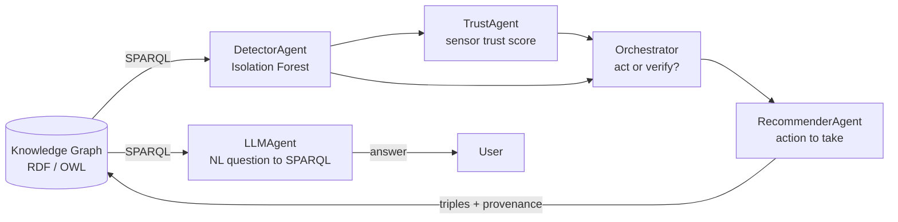
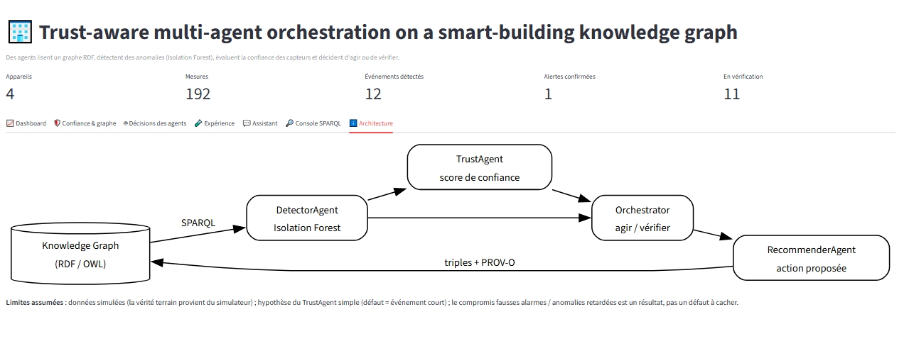
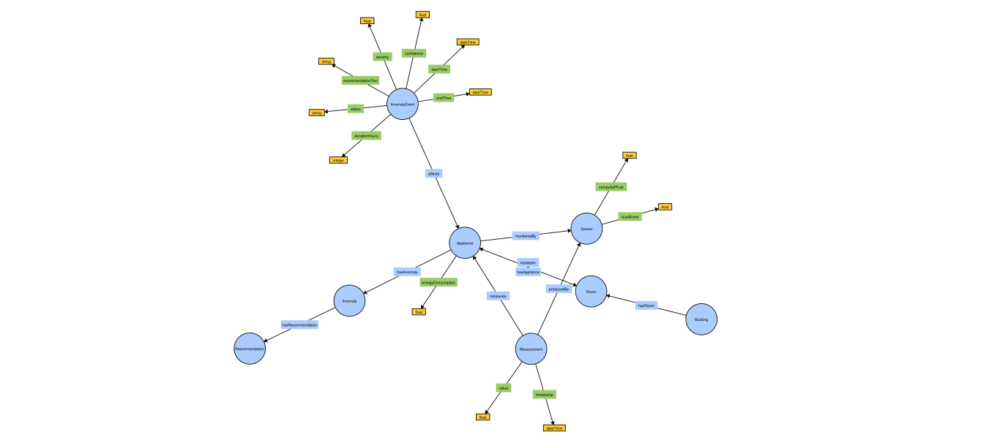
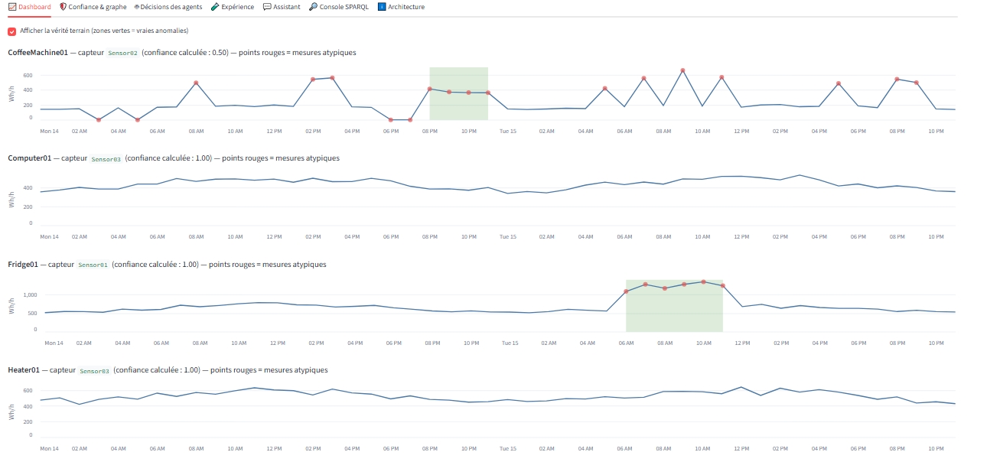
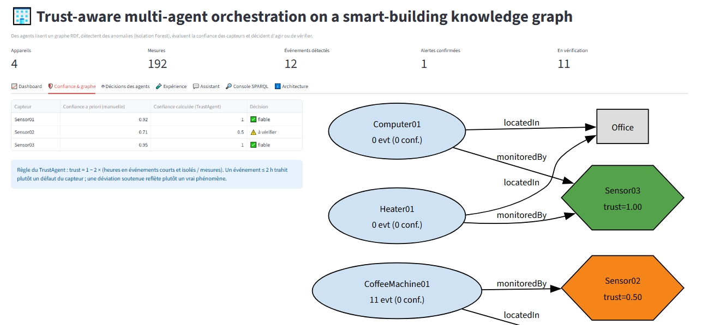
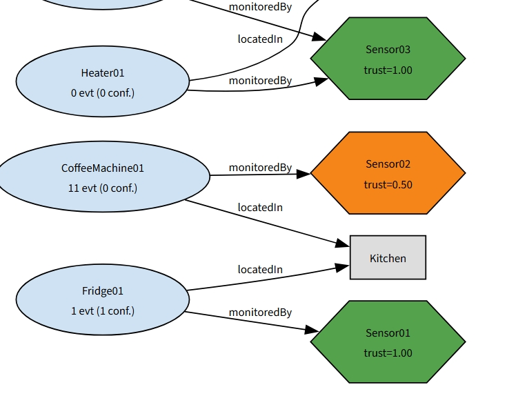
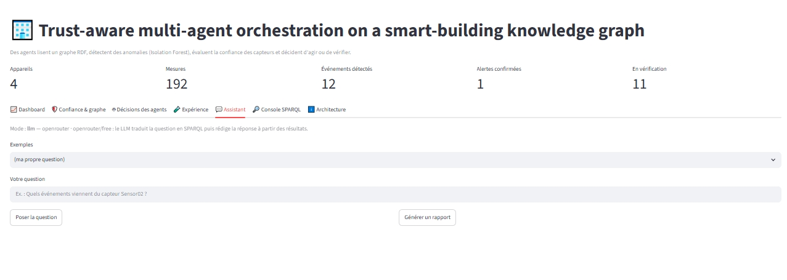
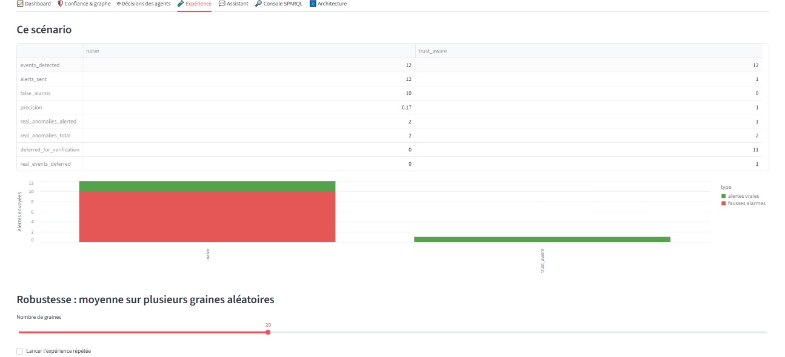

# Trust-Aware Semantic Knowledge Graph for Smart Buildings

A knowledge graph of a smart building, populated with simulated sensor data, where a small
multi-agent pipeline detects anomalies, scores each sensor's trustworthiness from its own
behaviour, and decides whether to act or to verify first, before any alert reaches an operator.

## Beyond a plain knowledge graph

A basic RDF/SPARQL project stores facts once and lets you query them. This one goes further: part
of the graph is written by hand, but another part is **generated** by a simulator and a third part
is **inferred** by a set of agents that write their own conclusions back into the same graph.
Concretely:

- Sensor trust is not a fixed number chosen up front,  it is **computed** from how each sensor has
  actually behaved over time.
- Not every detected anomaly becomes an alert. An **orchestrator** checks the source's trust first,
  and either confirms the alert or defers it for verification.
- The two strategies (alert on everything vs. trust-aware) are compared against a **known ground
  truth**, so the benefit of trust-awareness is measured, not just claimed.
- Beyond SPARQL, a **natural-language assistant** can be asked questions directly; it generates its
  own SPARQL query, runs it against the graph, and answers only from what it finds there.

The core idea: in a multi-agent system, a decision should depend on how much you trust the source
of the information, not only on what that source reports.

## Architecture



The knowledge graph is the **shared memory**: agents read it, reason over it, and write their
conclusions back into it, together with which agent produced what (a lightweight PROV-O
provenance trail). The LLM agent never decides anything , it only translates questions into
SPARQL and explains what the graph already contains.

## What's in the graph

- **Ontology** (`ontology/smart_building.ttl`): Building, Room, Appliance, Sensor, Measurement,
  Anomaly, AnomalyEvent, Recommendation, and the relations between them.
- **Static facts** (`data/building.ttl`): 1 building, 2 rooms, 4 appliances, 3 sensors, written by
  hand, including a manual prior trust score per sensor.
- **Simulated measurements** (`data/measurements.ttl`): `src/simulate.py` loads the building
  description, generates 48 hours of hourly readings per appliance (`src/simulation.py`), with one
  sensor made deliberately faulty (random spikes and signal loss) and two injected *real*
  anomalies, then writes the readings as RDF triples plus a separate ground truth file
  (`data/ground_truth.json`) that is never shown to the agents.
- **Inferred facts** (`data/inferred.ttl`, generated by `src/run_pipeline.py`): the anomaly events,
  computed trust scores, orchestration decisions and recommendations produced by the agents.

## The agents

| Agent | Question it answers | Method |
|---|---|---|
| DetectorAgent | Which measurements are atypical? | Isolation Forest on each appliance's ratio to its own median, plus a minimum-deviation threshold; consecutive atypical points become one event |
| TrustAgent | How much should I trust this sensor? | `trust = 1 − 2 × (hours in short, isolated events / total measurements)`. Short, isolated events point to a faulty sensor; sustained deviation points to a real phenomenon |
| Orchestrator | Act now, or check first? | `confirmed` if the source's trust ≥ threshold (0.8 by default), else `pending_verification` |
| RecommenderAgent | What should be done? | Rule-based text depending on status, duration and severity |
| LLMAgent | What does a plain-language question mean, and what does the graph say? | Translates the question into SPARQL (with a self-repair retry), runs it, and answers using only the returned rows |

## Results: naive vs. trust-aware orchestration

Same simulated scenario, two strategies, evaluated against the known ground truth
(`src/experiment.py`):

| Metric | Naive (alert on everything) | Trust-aware |
|---|---|---|
| Alerts sent | 12 | 1 |
| False alarms | 10 | 0 |
| Precision | 0.17 | 1.00 |
| Real anomalies caught (of 2) | 2 | 1 |
| Real anomalies deferred | 0 | 1 |

The naive strategy alerts on every detected event, so it never misses a real anomaly — but 10 of
its 12 alerts are false, which is what makes alert fatigue happen in practice. The trust-aware
strategy checks the source first: since one sensor's computed trust falls below the threshold, all
11 events coming from it are deferred instead of alerted, which removes every false alarm but also
delays the one real anomaly that happened to come from that same sensor.

Averaged over 20 random seeds, the same pattern holds: alerts drop from about 10 to about 1.75 and
precision rises from 0.22 to 0.90, at the cost of deferring roughly 0.85 real anomalies per run.
This is a trade-off, not a free win, and it is reported as such: trust-aware orchestration removes
almost all false alarms, but it can delay a genuine anomaly when it comes from a currently
low-trust sensor. That trade-off — fewer false alarms versus some delayed detections — is the
result worth discussing, not a flaw to hide.

## Screenshots

**Architecture**



**Ontology** — visualised with WebVOWL:



**Dashboard** — per-appliance consumption with detected outliers:



**Trust & graph view** — computed vs. manual trust, and the building graph colour-coded by
sensor reliability (two shots to cover the full graph):




**Assistant** — asking the graph a question in natural language (running here with a free-tier
OpenRouter API key: the LLM generates its own SPARQL query and answers only from the results):



**Experiment** — naive vs. trust-aware, single run and 20-seed average:



## Try it

```bash
pip install -r requirements.txt
python src/simulate.py       # generate simulated measurements + ground truth
python src/run_pipeline.py   # run the 4 agents, write conclusions back to the graph
python src/run_queries.py    # run all SPARQL queries (q1..q10)
python src/experiment.py     # naive vs. trust-aware, single run + 20-seed average
streamlit run src/app.py     # interactive dashboard, graph view, experiment, NL assistant
```

The Streamlit app lets you pick which sensors are faulty, the fault rate, the trust threshold and
the random seed, and see the agents react live. The natural-language assistant tab needs no API key
by default (rule-based fallback); it switches to full LLM mode as soon as a key for a supported
provider (Groq, OpenRouter, Gemini, Mistral, or Anthropic) is found in a local `.env` file, never
committed to the repo. The screenshot above was taken with a free-tier OpenRouter key.

## Repository structure

```
ontology/smart_building.ttl   ontology (classes & properties), written directly in Turtle
data/building.ttl             hand-written building description
data/*.ttl, *.json            generated: measurements, ground truth, inferred facts
queries/q1..q10.rq            SPARQL queries
src/kg.py                     graph loading & SPARQL helpers
src/simulation.py             sensor/measurement simulator
src/agents.py                 Detector, Trust, Orchestrator, Recommender
src/run_pipeline.py           runs the agents, writes data/inferred.ttl
src/evaluate.py, experiment.py  ground-truth comparison, naive vs. trust-aware
src/llm_agent.py              NL assistant: question -> SPARQL -> grounded answer
src/app.py                    Streamlit interface
```

## Limitations

- Measurements and anomalies are **simulated**; the ground truth used for evaluation comes from
  the simulator, not from a real building. Results validate the *mechanism*, not real-world
  performance.
- The TrustAgent's rule (short & isolated ⇒ sensor fault) is deliberately simple; a sensor that
  drifts steadily rather than spiking would be misread as a real phenomenon.
- The offline (no-API-key) assistant only recognises three question types (events, sensors,
  consumption); anything else falls back to the events view.
- Single building, single scenario shape; no real-time data ingestion.

## Path to real data

The ontology, the four agents and the interface only assume the graph's schema, not where the
data came from, so moving to a real building mainly means replacing `src/simulate.py` with a real
data source (sensor stream, building-management API, or exported logs) that writes the same
`Measurement` triples. Two things would need real calibration rather than code changes: the
TrustAgent's threshold, tuned here on 48 hours of synthetic data, and the evaluation itself, which
currently relies on a simulated ground truth that a real deployment would not have.

## Stack

RDF, OWL, SPARQL, RDFLib, scikit-learn (Isolation Forest), pandas, Streamlit, WebVOWL.
